# Mapping 2 Sample
R-script to map points for installing moisture probes 


> Author: Tomás Roquette Tenreiro

> Institute for Sustainable Agriculture (IAS-CSIC) - Córdoba, 2019

## 1 Introduction

### 1.1 R Markdown

This is a R Markdown (V3.6) type presentation. Markdown is a simple formatting syntax
for authoring HTML, PDF, and MS Word documents. The generated document includes both
content and output of any embedded R code chunks within the document. For more details see
http://rmarkdown.rstudio.com.

### 1.2 General introduction

The following R-script aims to describe an analytical procedure that combined multiple spatial data
in order to classify management zones for sampling and soil moisture probe installation. The main
goal is to distinguish management zones based on physical (i.e. orientation, elevation, texture,
ECa), chemical (pH), and biological (plant vigor) properties within a crop field. The selected field is
about 9.5 ha, located in the arable region of Cordoba. This document aims also to deliver a script
that can be adjusted to similar analyses or function as a guide to conduct geospatial analysis with
R. The reader can use this document both as a dissemination and a decision supporting tool.

### 1.3 Necessary material - R libraries

The first step consists on updating all necessary libraries for this analysis.

```{r}
install.packages(”rmarkdown”)
install.packages(”dplyr”)
install.packages(”plyr”)
install.packages(”reshape2”)
install.packages(”agricolae”)
install.packages(”quantreg”)
install.packages(”ploty”)
install.packages(”sf”)
install.packages(”raster”)
install.packages(”spData”)
install.packages(’spDataLarge’, repos=’https://nowosad.github.io/drat/’, type=’source’)
install.packages(”gridExtra”)
install.packages(”RColorBrewer”)
install.packages(”root.dir”)
install.packages(”tidyverse”)
install.packages(”ggplot2”)
install.packages(”wesanderson”)
install.packages(”ggpmisc”)
install.packages(”knitr”)
install.packages(”installr”)
install.packages(”lmtest”, repos = ”http://cran.us.r-project.org”)
install.packages(”tinytex”)
```

The second step consists on calling all libraries to the script.
```{r}
library(knitr)
library(sf)
library(dplyr)
library(plyr)
library(reshape2)
library(agricolae)
library(quantreg)
library(plotly)
library(sp)
library(spDataLarge)
library(spData)
library(tmap)
library(raster)
library(gridExtra)
library(quantreg)
library(ggplot2)
library(RColorBrewer)
library(tidyverse)
library(gridExtra)
library(wesanderson)
library(ggpmisc)
library(markdown)
library(tinytex)
library(lmtest)
```
### 1.4 Initial details - working directory

In this section we set initial details to specify the working directory; in this particular case the analysis
was linked to the internal folder "Experimental Catchment Cordoba 19 20" where input and output
data is saved. To run this code please specify the working directory where your input files are saved.

```{r}
rm(list=ls())
getwd()
knitr::opts_chunk$set(echo = TRUE)
knitr::opts_knit$set(root.dir = "C:/Users/Tomas R. Tenreiro/Desktop/Experimental_Catchment_Cordoba_19_20")
```

### 1.5 Input material

This section uploads all input material. In this particular case, we will work with satellite data
(Sentinel-2), atmospherically corrected (and cloud cover < 4%), that was downloaded from Sentinel-
HUB browser https://apps.sentinel-hub.com/. The script considers imagery from two growing seasons
(i.e. 2017/18 and 2018/19). In order to explore spatial correlation between plant vigor and soil
properties under rain-fed conditions, we focused on late phenological stages before crop senescence.
First year imagery corresponds to a winter wheat crop and second year imagery corresponds to a
rapeseed crop.

```{r}
# Date 1
Sentinel_Red_19.04.2018 <- raster("sentinel/R_analysis/Sentinel_Red_19.04.2018.tiff")
Sentinel_NIR_19.04.2018 <- raster("sentinel/R_analysis/Sentinel_NIR_19.04.2018.tiff")

# Date 2
Sentinel_Red_07.05.2018 <- raster("sentinel/R_analysis/Sentinel_Red_07.05.2018.tiff")
Sentinel_NIR_07.05.2018 <- raster("sentinel/R_analysis/Sentinel_NIR_07.05.2018.tiff")

# Date 3
Sentinel_Red_14.05.2018 <- raster("sentinel/R_analysis/Sentinel_Red_14.05.2018.tiff")
Sentinel_NIR_14.05.2018 <- raster("sentinel/R_analysis/Sentinel_NIR_14.05.2018.tiff")

# Date 4
Sentinel_Red_16.06.2018 <- raster("sentinel/R_analysis/Sentinel_Red_16.06.2018.tiff")
Sentinel_NIR_16.06.2018 <- raster("sentinel/R_analysis/Sentinel_NIR_16.06.2018.tiff")

# Date 5
Sentinel_Red_04.04.2019 <- raster("sentinel/R_analysis/Sentinel_Red_04.04.2019.tiff")
Sentinel_NIR_04.04.2019 <- raster("sentinel/R_analysis/Sentinel_NIR_04.04.2019.tiff")

# Date 6
Sentinel_Red_14.04.2019 <- raster("sentinel/R_analysis/Sentinel_Red_14.04.2019.tiff")
Sentinel_NIR_14.04.2019 <- raster("sentinel/R_analysis/Sentinel_NIR_14.04.2019.tiff")

# Date 7
Sentinel_Red_27.04.2019 <- raster("sentinel/R_analysis/Sentinel_Red_27.04.2019.tiff")
Sentinel_NIR_27.04.2019 <- raster("sentinel/R_analysis/Sentinel_NIR_27.04.2019.tiff")

# Date 8
Sentinel_Red_14.05.2019 <- raster("sentinel/R_analysis/Sentinel_Red_14.05.2019.tiff")
Sentinel_NIR_14.05.2019 <- raster("sentinel/R_analysis/Sentinel_NIR_14.05.2019.tiff")

## 2 Geo-spatial analysis of satellite NDVI

### 2.1 Estimate NDVI

This section estimates NDVI considering that Satellite B4 corresponds to Red wave length and B8
to NIR wave length. Data is in raster format with a spatial resolution of 10x10 m.

```{r}
# NDVI 2018
Sentinel_NDVI_19.04.2018 <- (Sentinel_NIR_19.04.2018 - Sentinel_Red_19.04.2018) / (Sentinel_NIR_19.04.2018 + Sentinel_Red_19.04.2018)
Sentinel_NDVI_07.05.2018 <- (Sentinel_NIR_07.05.2018 - Sentinel_Red_07.05.2018) / (Sentinel_NIR_07.05.2018 + Sentinel_Red_07.05.2018)
Sentinel_NDVI_14.05.2018 <- (Sentinel_NIR_14.05.2018 - Sentinel_Red_14.05.2018) / (Sentinel_NIR_14.05.2018 + Sentinel_Red_14.05.2018)
Sentinel_NDVI_16.06.2018 <- (Sentinel_NIR_16.06.2018 - Sentinel_Red_16.06.2018) / (Sentinel_NIR_16.06.2018 + Sentinel_Red_16.06.2018)

#NDVI 2019
Sentinel_NDVI_04.04.2019 <- (Sentinel_NIR_04.04.2019 - Sentinel_Red_04.04.2019) / (Sentinel_NIR_04.04.2019 + Sentinel_Red_04.04.2019)
Sentinel_NDVI_14.04.2019 <- (Sentinel_NIR_14.04.2019 - Sentinel_Red_14.04.2019) / (Sentinel_NIR_14.04.2019 + Sentinel_Red_14.04.2019)
Sentinel_NDVI_27.04.2019 <- (Sentinel_NIR_27.04.2019 - Sentinel_Red_27.04.2019) / (Sentinel_NIR_27.04.2019 + Sentinel_Red_27.04.2019)
Sentinel_NDVI_14.05.2019 <- (Sentinel_NIR_14.05.2019 - Sentinel_Red_14.05.2019) / (Sentinel_NIR_14.05.2019 + Sentinel_Red_14.05.2019)
```

### 2.2 Create maps of NDVI

Here we use ’tm shape’ function applied to raster data (tm raster). It is important to confirm we
have uploaded the library ’tmap’.

```{r}
# Map NDVI 2018
NDVI_19.04.2018 <- tm_shape(Sentinel_NDVI_19.04.2018) + tm_raster(palette="YlGn",n=5) + tm_legend(outside = TRUE, text.size = 1.2)
NDVI_07.05.2018 <- tm_shape(Sentinel_NDVI_07.05.2018) + tm_raster(palette="YlGn",n=5) + tm_legend(outside = TRUE, text.size = 1.2)
NDVI_14.05.2018 <- tm_shape(Sentinel_NDVI_14.05.2018) + tm_raster(palette="YlGn",n=5) + tm_legend(outside = TRUE, text.size = 1.2)
NDVI_16.06.2018 <- tm_shape(Sentinel_NDVI_16.06.2018) + tm_raster(palette="YlGn",n=5) + tm_legend(outside = TRUE, text.size = 1.2)

# Map NDVI 2019
NDVI_04.04.2019 <- tm_shape(Sentinel_NDVI_04.04.2019) + tm_raster(palette="YlGn",n=5) + tm_legend(outside = TRUE, text.size = 1.2)
NDVI_14.04.2019 <- tm_shape(Sentinel_NDVI_14.04.2019) + tm_raster(palette="YlGn",n=5) + tm_legend(outside = TRUE, text.size = 1.2)
NDVI_27.04.2019 <- tm_shape(Sentinel_NDVI_27.04.2019) + tm_raster(palette="YlGn",n=5) + tm_legend(outside = TRUE, text.size = 1.2)
NDVI_14.05.2019 <- tm_shape(Sentinel_NDVI_14.05.2019) + tm_raster(palette="YlGn",n=5) + tm_legend(outside = TRUE, text.size = 1.2)
```

### 2.3 Visualize NDVI raster maps

First for 2018:

Note: ”ncol” means the number of columns up to a maximum limit of 4 features.

```{r}
tmap arrange(NDVI_19.04.2018, NDVI_07.05.2018, NDVI_14.05.2018, NDVI_16.06.2018, nncol=2)
```
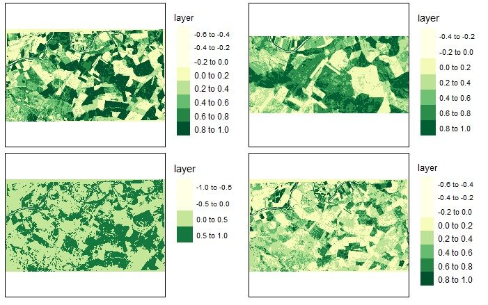

Second for 2019:

```{r}
tmap arrange(NDVI_04.04.2019, NDVI_14.04.2019, NDVI_27.04.2019, NDVI_14.05.2019, ncol=2)
```
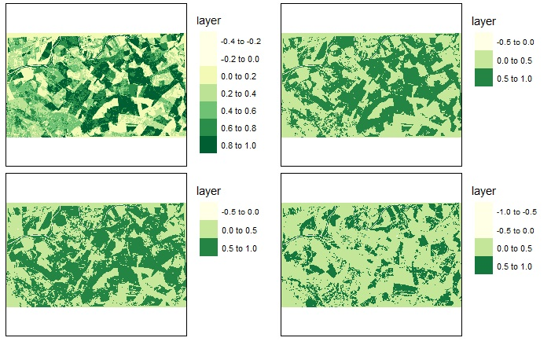

### 2.4 Upload the field vector for clip operations

The selected field vector should be the shapefile polygon of the field. In this particular case,
the shapefile was obtained with QGIS considering a topographic characterization of the selected
catchment. The catchment was spatially defined according to a map of flow directions (raster)
obtained with the SAGA - Wang Liu algorithm. The algorithm defines water flow and hillshades
orientation in a particular area of interest from a DEM. We used a DEM with 5m spatial resolution
obtained with LiDAR from CNIG ( http://centrodedescargas.cnig.es/CentroDescargas /index.jsp ).
A catchment was isolated with an area of approximately 9.5 ha.

```{r}
# Upload field vector
field_vector <- st read(”sentinel/R_analysis/Field_vector.shp”)
```

In this step it is also important to check whether the coordinate system is the same as the satellite
imagery; in this particular case we will work with the system WGS84 EPSG 4326.

```{r}
# Check coordinate system
crs(field_vector)
crs(Sentinel_NDVI_27.04.2019) # as an example to check coordinate system of rasters
```

### 2.5 Cropping and Masking tools

In the following section the script crops and masks the NDVI maps by the field vector shapefile.
For more info about these functions please check the outcome and have a look at the following link
https://rpubs.com/ricardo ochoa/416711

```{r}
# Crop NDVI data 2018
cropped_feature_1 = crop(Sentinel_NDVI_19.04.2018, field_vector)
plot (cropped_feature_1)
cropped_feature_2 = crop(Sentinel_NDVI_07.05.2018, field_vector)
plot (cropped_feature_2)
cropped_feature_3 = crop(Sentinel_NDVI_14.05.2018, field_vector)
plot (cropped_feature_3)
cropped_feature_4 = crop(Sentinel_NDVI_16.06.2018, field_vector)
plot (cropped_feature_4)

# Mask NDVI data 2018
masked_feature_1 = mask(Sentinel_NDVI_19.04.2018, field_vector)
plot(masked_feature_1)
masked_feature_2 = mask(Sentinel_NDVI_07.05.2018, field_vector)
plot(masked_feature_2)
masked_feature_3 = mask(Sentinel_NDVI_14.05.2018, field_vector)
plot(masked_feature_3)
masked_feature_4 = mask(Sentinel_NDVI_16.06.2018, field_vector)
plot(masked_feature_4)

# Crop NDVI data 2019
cropped_feature_5 = crop(Sentinel_NDVI_04.04.2019, field_vector)
plot (cropped_feature_5)
cropped_feature_6 = crop(Sentinel_NDVI_14.04.2019, field_vector)
plot (cropped_feature_6)
cropped_feature_7 = crop(Sentinel_NDVI_27.04.2019, field_vector)
plot (cropped_feature_7)
cropped_feature_8 = crop(Sentinel_NDVI_14.05.2019, field_vector)
plot (cropped_feature_8)

# Mask NDVI data 2019
masked_feature_5 = mask(Sentinel_NDVI_04.04.2019, field_vector)
plot(masked_feature_5)
masked_feature_6 = mask(Sentinel_NDVI_14.04.2019, field_vector)
plot(masked_feature_6)
masked_feature_7 = mask(Sentinel_NDVI_27.04.2019, field_vector)
plot(masked_feature_7)
masked_feature_8 = mask(Sentinel_NDVI_14.05.2019, field_vector)
plot(masked_feature_8)
```
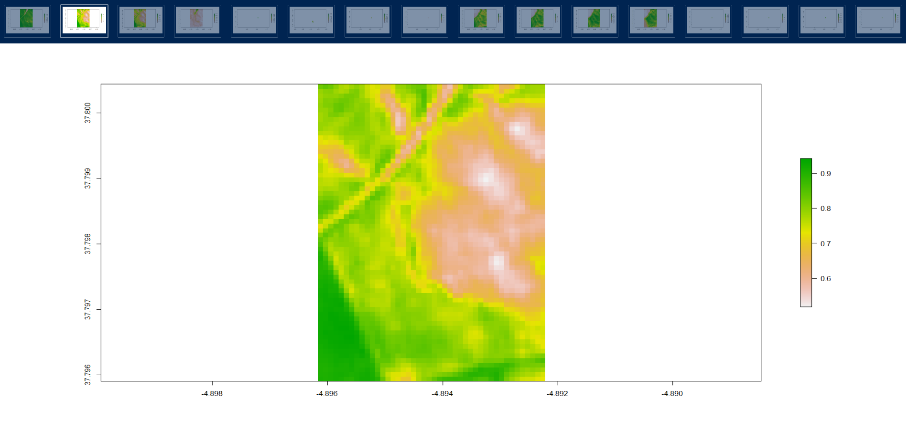

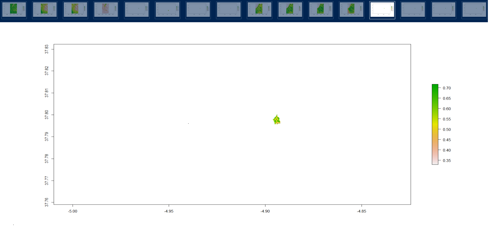

### 2.6 Visualization mode: Interactive (view) vs. Static (plot) viewing

Here we switch to an interactive viewing mode of the outcomes (please run this script in R-studio
to check zooming options). If you want to get back to the ”static” mode please switch ’view’ by
’plot’ in the function term ’tmap mode()’.

```{r}
tmap_mode(”view”)
# or tmap_mode(”plot”) instead
```

### 2.7 Interactive mapping of masked NDVI rasters

```{r}
# For 2018
masked_1 <- tm_shape(masked_feature_1) + tm_raster(palette="YlGn",n=10, title="NDVI_19.04.2018") + tm_legend(outside = TRUE, text.size = 1.2)
masked_2 <- tm_shape(masked_feature_2) + tm_raster(palette="YlGn",n=10, title="NDVI_07.05.2018") + tm_legend(outside = TRUE, text.size = 1.2)
masked_3 <- tm_shape(masked_feature_3) + tm_raster(palette="YlGn",n=10, title="NDVI_14.05.2018") + tm_legend(outside = TRUE, text.size = 1.2)
masked_4 <- tm_shape(masked_feature_4) + tm_raster(palette="YlGn",n=10, title="NDVI_16.06.2018") + tm_legend(outside = TRUE, text.size = 1.2)

# For 2019
masked_5 <- tm_shape(masked_feature_5) + tm_raster(palette="YlGn",n=10, title="NDVI_04.04.2019") + tm_legend(outside = TRUE, text.size = 1.2)
masked_6 <- tm_shape(masked_feature_6) + tm_raster(palette="YlGn",n=10, title="NDVI_14.04.2019") + tm_legend(outside = TRUE, text.size = 1.2)
masked_7 <- tm_shape(masked_feature_7) + tm_raster(palette="YlGn",n=10, title="NDVI_27.04.2019") + tm_legend(outside = TRUE, text.size = 1.2)
masked_8 <- tm_shape(masked_feature_8) + tm_raster(palette="YlGn",n=10, title="NDVI_14.05.2019") + tm_legend(outside = TRUE, text.size = 1.2)
```

### 2.8 Print NDVI masked map for 2018

It is possible to zoom each facet separately in R-studio and move the corresponding maps.

```{r}
tmap_arrange(masked_1, masked_2, masked_3, masked_4, ncol=2)
```

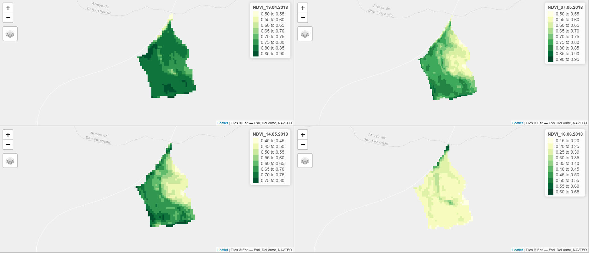

### 2.9 Print NDVI masked map for 2019

```{r}
tmap arrange(masked_5, masked_6, masked_7, masked_8, ncol=2)
```

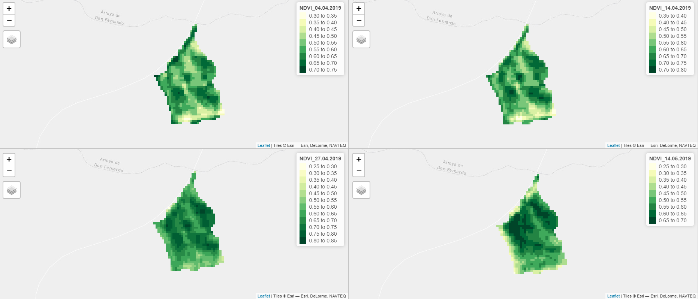


### 2.10 Display facets for 2018

1) We convert 2018 raster data into vectorial point-based data while keeping the same spatial
resolution (10x10m); 

2) Use of ’tmap arrange’ to display facets for NDVI vectorial mapping (2018).

```{r}
# From raster to point
NDVI_vector_19.04.2018 <- rasterToPoints(masked_feature_1, spatial = TRUE) %>% st_as_sf()
NDVI_vector_07.05.2018 <- rasterToPoints(masked_feature_2, spatial = TRUE) %>% st_as_sf()
NDVI_vector_14.05.2018 <- rasterToPoints(masked_feature_3, spatial = TRUE) %>% st_as_sf()
NDVI_vector_16.06.2018 <- rasterToPoints(masked_feature_4, spatial = TRUE) %>% st_as_sf()

# Correct feature name
names(NDVI_vector_19.04.2018)[names(NDVI_vector_19.04.2018) == "layer"] <- "NDVI_19.04.2018"
names(NDVI_vector_07.05.2018)[names(NDVI_vector_07.05.2018) == "layer"] <- "NDVI_07.05.2018"
names(NDVI_vector_14.05.2018)[names(NDVI_vector_14.05.2018) == "layer"] <- "NDVI_14.05.2018"
names(NDVI_vector_16.06.2018)[names(NDVI_vector_16.06.2018) == "layer"] <- "NDVI_16.06.2018"

# Create maps for 2018
NDVI_points_1 <- tm_shape(NDVI_vector_19.04.2018) + tm_dots(col="NDVI_19.04.2018", palette="YlGn", n=10) + tm_style("cobalt") + 
tm_legend(outside = TRUE, text.size = 1.2)
NDVI_points_2 <- tm_shape(NDVI_vector_07.05.2018) + tm_dots(col="NDVI_07.05.2018", palette="YlGn", n=10) + tm_style("cobalt") + 
  tm_legend(outside = TRUE, text.size = 1.2)
NDVI_points_3 <- tm_shape(NDVI_vector_14.05.2018) + tm_dots(col="NDVI_14.05.2018", palette="YlGn", n=10) + tm_style("cobalt") + 
  tm_legend(outside = TRUE, text.size = 1.2)
NDVI_points_4 <- tm_shape(NDVI_vector_16.06.2018) + tm_dots(col="NDVI_16.06.2018", palette="YlGn", n=10) + tm_style("cobalt") + 
  tm_legend(outside = TRUE, text.size = 1.2)

# Display facets
tmap_arrange(NDVI_points_1,
             NDVI_points_2,
             NDVI_points_3,
             NDVI_points_4,
             ncol=4)
```
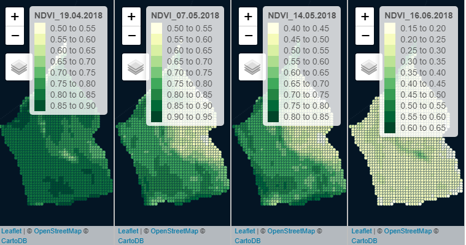

The previous script is a ’tmap-element’ that specifies facets (small multiples). Small multiples
can be created in two ways: 1) by specifying the by argument with one or two variable names, by which the data is grouped, 2) by specifying multiple variable names in any of the aesthetic argument
of the layer functions (for instance, the argument col in ’tm fill’). For more information please
check https://www.rdocumentation.org/packages/tmap/versions/2.3-1/topics/tm facets.

### 2.11 Display facets for 2019

1) We convert 2019 raster data into vectorial point-based data while keeping the same spatial
resolution (10x10m); 

2) Use of ’tmap arrange’ to display facets for NDVI vectorial mapping (2019).

```{r}
# From raster to point
NDVI_vector_04.04.2019 <- rasterToPoints(masked_feature_5, spatial = TRUE) %>% st_as_sf()
NDVI_vector_14.04.2019 <- rasterToPoints(masked_feature_6, spatial = TRUE) %>% st_as_sf()
NDVI_vector_27.04.2019 <- rasterToPoints(masked_feature_7, spatial = TRUE) %>% st_as_sf()
NDVI_vector_14.05.2019 <- rasterToPoints(masked_feature_8, spatial = TRUE) %>% st_as_sf()

# Correct feature name
names(NDVI_vector_04.04.2019)[names(NDVI_vector_04.04.2019) == "layer"] <- "NDVI_04.04.2019"
names(NDVI_vector_14.04.2019)[names(NDVI_vector_14.04.2019) == "layer"] <- "NDVI_14.04.2019"
names(NDVI_vector_27.04.2019)[names(NDVI_vector_27.04.2019) == "layer"] <- "NDVI_27.04.2019"
names(NDVI_vector_14.05.2019)[names(NDVI_vector_14.05.2019) == "layer"] <- "NDVI_14.05.2019"

# Create maps for 2019
NDVI_points_5 <- tm_shape(NDVI_vector_04.04.2019) + tm_dots(col="NDVI_04.04.2019", palette="YlGn", n=10) + tm_style("cobalt") + 
  tm_legend(outside = TRUE, text.size = 1.2)
NDVI_points_6 <- tm_shape(NDVI_vector_14.04.2019) + tm_dots(col="NDVI_14.04.2019", palette="YlGn", n=10) + tm_style("cobalt") + 
  tm_legend(outside = TRUE, text.size = 1.2)
NDVI_points_7 <- tm_shape(NDVI_vector_27.04.2019) + tm_dots(col="NDVI_27.04.2019", palette="YlGn", n=10) + tm_style("cobalt") + 
  tm_legend(outside = TRUE, text.size = 1.2)
NDVI_points_8 <- tm_shape(NDVI_vector_14.05.2019) + tm_dots(col="NDVI_14.05.2019", palette="YlGn", n=10) + tm_style("cobalt") + 
  tm_legend(outside = TRUE, text.size = 1.2)

# Display facets
tmap_arrange(NDVI_points_5,
             NDVI_points_6,
             NDVI_points_7,
             NDVI_points_8,
             ncol=4)
```
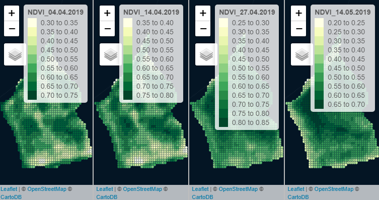

## 3 Geo-spatial analysis of field data

### 3.1 Display sampling and ECa measuring photos

Some photos of the measures taken with a Dualem sensor (i.e. electromagnetic induction sensor),
spatial resolution of 1x15m. Soil ECa was measured at 35 and 85 cm depth before sowing and a
few days after a rainfall event of aprox. 10 mm. Soil samples were also collected to estimate pH
and clay content.

For more info in regard to ECa sensing/mapping please read:

- Johnson, C. K., Doran, J. W., Duke, H. R., Wienhold, B. J., Eskridge, K. M., & Shanahan,
J. F. (2001). Field-scale electrical conductivity mapping for delineating soil condition. Soil Science
Society of America Journal, 65(6), 1829-1837.

- McCutcheon, M. C., Farahani, H. J., Stednick, J. D., Buchleiter, G. W., & Green, T. R.
(2006). Effect of soil water on apparent soil electrical conductivity and texture relationships in a
dryland field. Biosystems Engineering, 94(1), 19-32.

```{r}
# Upload libraries 'imager' and 'png'
library(knitr)    # For knitting document and include_graphics function
library(ggplot2)  # For plotting
library(png)      # For grabbing the dimensions of png files

#Define file ath
img1_path <- "sentinel/R_analysis/Pictures_Sampling/1.png"
img2_path <- "sentinel/R_analysis/Pictures_Sampling/2.png"
img3_path <- "sentinel/R_analysis/Pictures_Sampling/3.png"
img4_path <- "sentinel/R_analysis/Pictures_Sampling/4.png"
img5_path <- "sentinel/R_analysis/Pictures_Sampling/3.png"
img6_path <- "sentinel/R_analysis/Pictures_Sampling/4.png"

# Display pictures
include_graphics(img1_path) 
include_graphics(img2_path) 
include_graphics(img3_path) 
include_graphics(img4_path) 
include_graphics(img5_path) 
include_graphics(img6_path) 
```


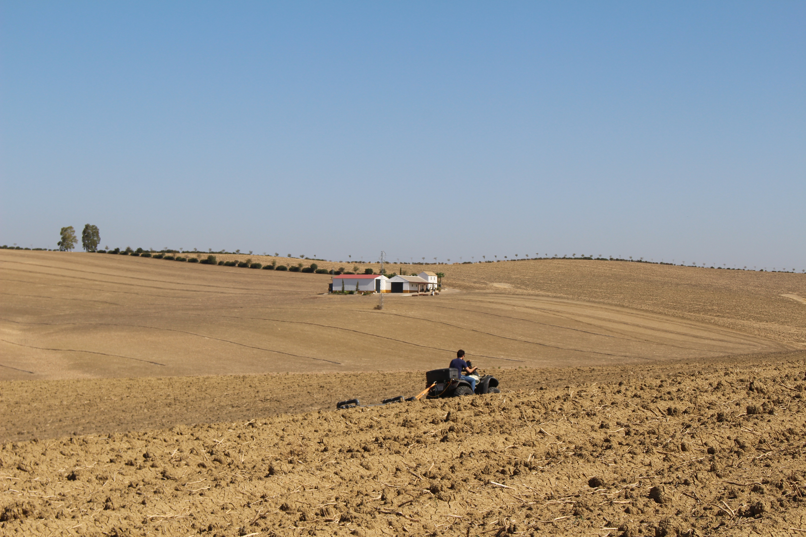

### 3.2 Upload soil physical and chemical data

Data collected at 10th October 2019; Field location: Guad´alcazar, C´ordoba, Spain.

Five different types of properties:

1) Soil texture (%Clay, %Sand);

2) Soil ECa (35 and 85 cm depth);

3) Slope orientation (degrees);

4) Elevation (m);

5) Soil pH;

```{r}
# Upload raster data
GF_Elevation     <- raster("GF_Elevation.tif")
GF_Orientation   <- raster("GF_Orientation.tif")
GF_ECa1          <- raster("GF_CEa1.tif")
GF_ECa2          <- raster("GF_CEa2.tif")

# Convert to point vectorial data
GF_Elevation_dots <- rasterToPoints(GF_Elevation, spatial = TRUE) %>% st_as_sf()
names(GF_Elevation_dots)[names(GF_Elevation_dots) == "GF_Elevation"] <- "Elevation"
GF_Orientation_dots <- rasterToPoints(GF_Orientation, spatial = TRUE) %>% st_as_sf()
names(GF_Orientation_dots)[names(GF_Orientation_dots) == "GF_Orientation"] <- "Orientation"
GF_ECa1_dots <- rasterToPoints(GF_ECa1, spatial = TRUE) %>% st_as_sf()
names(GF_ECa1_dots)[names(GF_ECa1_dots) == "GF_CEa1"] <- "ECa1"
GF_ECa2_dots <- rasterToPoints(GF_ECa2, spatial = TRUE) %>% st_as_sf()
names(GF_ECa2_dots)[names(GF_ECa2_dots) == "GF_CEa2"] <- "ECa2"
```

### 3.3 Join field data and NDVI data on a single shapefile

Here we run a spatial join in order to build a single shapefile containing point based data (10x10m)
with plant vigor (represented by NDVI), soil physical properties (elevation, orientation, ECa, texture)
and chemical data (pH).

```{r}
# Start spatial join (NDVI + Elevation + Orientation + ECa)
rm(MZ_joined)

MZ_joined = st_join(NDVI_vector_19.04.2018, NDVI_vector_07.05.2018["NDVI_07.05.2018"], join = st_nearest_feature)
MZ_joined = st_join(MZ_joined, NDVI_vector_14.05.2018["NDVI_14.05.2018"], join = st_nearest_feature)
MZ_joined = st_join(MZ_joined, NDVI_vector_16.06.2018["NDVI_16.06.2018"], join = st_nearest_feature)
MZ_joined = st_join(MZ_joined, NDVI_vector_04.04.2019["NDVI_04.04.2019"], join = st_nearest_feature)
MZ_joined = st_join(MZ_joined, NDVI_vector_14.04.2019["NDVI_14.04.2019"], join = st_nearest_feature)
MZ_joined = st_join(MZ_joined, NDVI_vector_27.04.2019["NDVI_27.04.2019"], join = st_nearest_feature)
MZ_joined = st_join(MZ_joined, NDVI_vector_14.05.2019["NDVI_14.05.2019"], join = st_nearest_feature)
MZ_joined = st_join(MZ_joined, GF_Elevation_dots["Elevation"], join = st_nearest_feature)
MZ_joined = st_join(MZ_joined, GF_Orientation_dots["Orientation"], join = st_nearest_feature)
MZ_joined = st_join(MZ_joined, GF_ECa1_dots["ECa1"], join = st_nearest_feature)
MZ_joined = st_join(MZ_joined, GF_ECa2_dots["ECa2"], join = st_nearest_feature)

# Convert Eca from mS/m to dS/m and estimate ECa mean
MZ_joined$ECa1     <- MZ_joined$ECa1/100
MZ_joined$ECa2     <- MZ_joined$ECa2/100
MZ_joined$EC_mean  <- ((MZ_joined$ECa1+MZ_joined$ECa2)/2)

# A simple classification of soil texture proposed by Greenfields: http://www.greenfield.agrodrone.es/ 
MZ_joined$Texture  <- "Clay_loamy"
MZ_joined$Texture[MZ_joined$ECa2 > 0.60]  <- "Clay"
MZ_joined$Texture[MZ_joined$ECa1 < 0.10]  <- "Clay_loamy"
tm_shape(MZ_joined) + tm_dots(col = "Texture", palette = "RdYlGn", n=2) + tm_style("cobalt"))
```
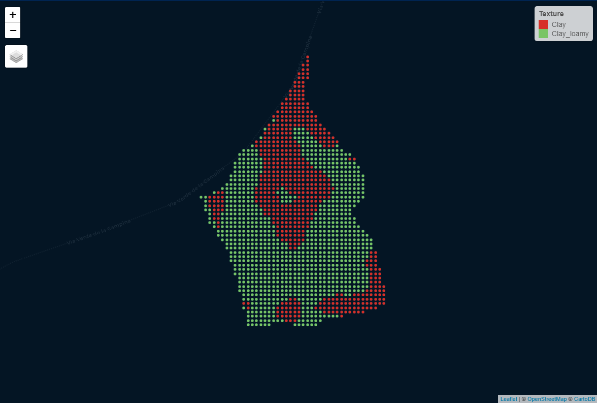

### 3.4 From soil sampling to mapping

A total of 10 soil samples were collected at 30-40cm according to the spatial pattern of ECa. Data is
spatially interpolated following a ’nearest-feature’ algorithm in order to produce point based vectorial
maps with the same spatial resolution of MZ joined (10x10m).

```{r}
# Upload sampling dots
Sampling_vector <- st_read("Sampling_dots.shp")
Sampling_map    <- tm_shape(Sampling_vector) + tm_dots(col = "green", palette = "RdYlGn", n=6) + tm_style("cobalt")
Sampling_map  

# Rename: translating from Spanish to English
names(Sampling_vector)[names(Sampling_vector) == "ARCILLA"] <- "Clay"
names(Sampling_vector)[names(Sampling_vector) == "PH"] <- "pH"
names(Sampling_vector)[names(Sampling_vector) == "ARENA"] <- "Sand"
```


```{r}
# A few sampling photos
img7_path <- "sentinel/R_analysis/Pictures_Sampling/7.png"
img8_path <- "sentinel/R_analysis/Pictures_Sampling/8.png"

# Display pictures
include_graphics(img7_path) 
include_graphics(img8_path) 

```


Here we interpolate sampling data by applying a spatial join through ’st nearest feature’.

```{r}
# Spatial join
MZ_joined = st_join(MZ_joined, Sampling_vector["Clay"], join = st_nearest_feature)
MZ_joined = st_join(MZ_joined, Sampling_vector["pH"], join = st_nearest_feature)
MZ_joined = st_join(MZ_joined, Sampling_vector["Sand"], join = st_nearest_feature)

# Map sampling points
Clay_map <- tm_shape(MZ_joined) + tm_dots(col = "Clay", palette = "YlOrBr", n=8) + tm_style("cobalt") 
Sand_map <- tm_shape(MZ_joined) + tm_dots(col = "Sand", palette = "Oranges", n=8) + tm_style("cobalt") 
pH_map   <- tm_shape(MZ_joined) + tm_dots(col = "pH", palette = "Purples", n=8) + tm_style("cobalt")

# Display
tmap_arrange(Clay_map,
             Sand_map,
             pH_map,
             ncol=3)
```
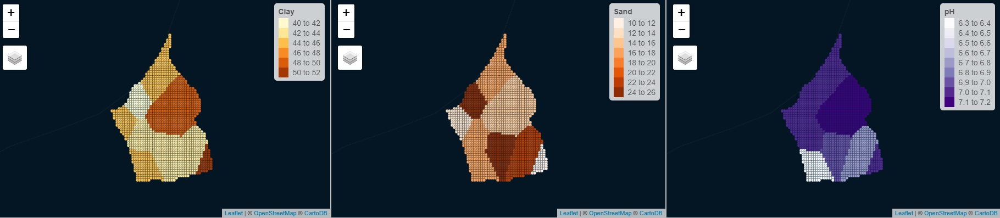

The field is characterized by a lower variation of clay and sandy content. Clay content varies
from 40 to 52% and sandy content from 10 to 26%. We don’t expect texture to be a major driver
of crop spatial heterogeneity. Therefore, we focused mostly on topography.

```{r}
# Estimate CV
cv_Clay      = cv(MZ_joined$Clay)
cv_Sand      = cv(MZ_joined$Sand)
cv_pH        = cv(MZ_joined$pH)
cv_ECa1      = cv(MZ_joined$ECa1)
cv_ECa2      = cv(MZ_joined$ECa2)
cv_O         = cv(MZ_joined$Orientation)
cv_E         = cv(MZ_joined$Elevation)
cv_NDVI_2018 = cv(MZ_joined$NDVI_07.05.2018)
cv_NDVI_2019 = cv(MZ_joined$NDVI_14.04.2019)

# Print results
# cv_Clay = 6.65 %
# cv_Sand = 25.97 %
# cv_pH = 3.32 %
# cv_ECa1 = 39.36 %
# cv_ECa2 = 26.76 %
# cv_O = 61.79 %
# cv_E = 4.86 %
# cv_NDVI_2018 = 11.79 %
# cv_NDVI_2019 = 13.12 %

# Apparently the most variable properties are % Sand, ECa and orientation; but be careful when interpreting ’cv’ of
spatial data; orientation for instance, which has the largest cv is expressed in degrees, which means that values close
to zero represent similar orientations to values close to 360, in this sense, a large ’cv’ does not necessarily imply a
large variation.
```

### 3.5 Principal components (filtering and grouping variables)

This section addresses the importance of reducing dimensions. What is the minimal amount of
properties that we must take into account to perform a satisfactory classification? At this stage, we
have a shapefile with 15 different continuous variables (8 different dates of NDVI for two cropping
years, ECa1, ECa2, pH, Sand, Clay, Orientation and Elevation). First we conduct a Principal Component
Analysis (PCA) to understand the proportion of variation for each component and to select
the most important and correlated variables. A PCA does not discard any samples or characteristics
(variables). Instead, it reduces the overwhelming number of dimensions by constructing principal
components (PC).

```{r}
MZ_joined$ndvi_2018 <- ((MZ_joined$NDVI_07.05.2018 + MZ_joined$NDVI_14.05.2018 + MZ_joined$NDVI_19.04.2018) / 3)
MZ_joined$ndvi_2019 <- ((MZ_joined$NDVI_04.04.2019 + MZ_joined$NDVI_04.04.2019 + MZ_joined$NDVI_27.04.2019) / 3)
MZ_joined$ndvi      <- ((MZ_joined$ndvi_2018 + MZ_joined$ndvi_2019) / 2)

MZ_joined$ID <- seq.int(nrow(MZ_joined))
dataframe = fortify(MZ_joined)
dataframe$geometry <- NULL

dataframe <- dataframe[,c(1:12,15:21)]
#dataframe <- dataframe[c(1:12,15:17,20,22,24,25)]
data.pca <- prcomp(dataframe[,c(1:15)], scale = TRUE)
#data.pca <- prcomp(dataframe[,c(9:15,17:19)], scale = TRUE)
summary(data.pca)
autoplot(data.pca, colour = 'white', loadings = TRUE, loadings.label = TRUE, loadings.label.size  = 5)

data.pca$rotation
```
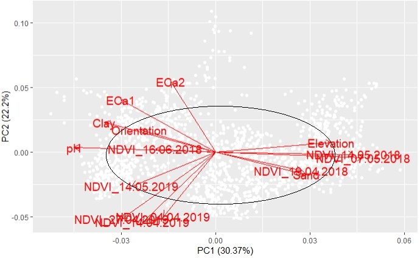

In this particular case, the analysis aims to define management zones which are zones with homogeneous
response curves of plant vigor (NDVI) to certain properties (ECa, Elevation, Orientation).
From our PCA, it is possible to observe that in terms of NDVI two dates have a relatively low
proportion of variance (i.e. NDVI 16.06.2018 and NDVI 14.05.2019), which are therefore ignored.
From the PCA plot, we observe a strong correlation in the first principal component (PC1)
between Elevation and NDVI for both years. The correlation is positive for 2018 and negative for
2019 but the PC score is comparable (about 0.3, slightly less for NDVI 2019). The euclidean space
represented in the PCA plot indicates that Orientation might also be correlated to the variation of NDVI 2018 since both reveal similar PC2 scores. In the case of ECa, ECa1 is better correlated to
NDVI than ECa2 (in PC2 as well). The correlation is positive in 2019 and negative in 2018. In
general, we may note a complete contrast between 2018 and 2019 imagery that is likely to be more
associated to the year conditions than to the crop species. Let’s confirm it by considering the annual distribution of rainfall for each year.

```{r}
# Import rainfall data for 2017/18 and 2018/19 (Data reported from October to September)
rm(Rain)

Rain <- read.csv(file=”Las300_Rainfall_2018_19.csv”, header=TRUE, sep=”,”)

# Prepare plot
rain_2018 <- subset(Rain, Year == 1)
rain_2019 <- subset(Rain, Year == 2)

graph_r_2018 <- ggplot(rain_2018, aes(x=Month number, y=P)) + geom_point(shape=21, size=2, stroke=1.5,
fill=”darkslateblue”) + # Set static color and size for points
geom_line(col=”blue”) + scale_colour_brewer(palette = ”Set1”) + coord_cartesian(xlim=c(1, 11.9), ylim=c(0, 300))
+ labs(title=”2018 Rainfall”, subtitle=”Monthly values”, y=”Precipitation (mm)”, x=”Month number (Month 1 =
October 2017)”, caption=”Hydrologic Year from October - September”)

graph_r_2018

# Cumulative late winter and spring rainfall: 480.5 mm
rain_2018$P[rain_2018$Month == ”February”] + rain_2018$P[rain_2018$Month == ”March”] +
rain_2018$P[rain_2018$Month == ”April”]
```


```{r}
graph_r_2019 <- ggplot(rain 2019, aes(x=Month number, y=P)) + geom_point(shape=21, size=2, stroke=1.5,
fill=”darkslateblue”) +
geom_line(col=”blue”) + scale_colour_brewer(palette = ”Set1”) + coord_cartesian(xlim=c(1, 11.9), ylim=c(0, 300))
+ labs(title=”2019 Rainfall”, subtitle=”Monthly values”, y=”Precipitation (mm)”, x=”Month number (Month 1 =
October 2018)”, caption=”Hydrologic Year from October - September”)

graph_r_2019

rain_2019$P[rain_2019$Month == ”February”] + rain_2019$P[rain_2018$Month == ”March”] +
rain_2019$P[rain_2019$Month == ”April”]

# Cumulative rainfall (Feb-April 2019): 78 mm
```


There is a clear contrast between 2018 and 2019 in terms of late winter and spring accumulated
rainfall. It is therefore consistent that we have a positive correlation between elevation and NDVI
for 2018 and negative for 2019. In a wet spring, the crop responded better on higher elevations due
to runoff and worse in lower zones due to saturation, and the opposite is observed for 2019 under
water shortage. The combination year x crop is not the best for our objective, we are mapping management zones
for a winter wheat crop and the historical wheat data is less affected by stress than the rapeseed
sown in 2019. So let’s have a look at the density plots for means of NDVI, considering the three
most correlated dates for each year (according to the PCA).

```{r}
# upload RColor library
library(RColorBrewer)

MZ_joined$ndvi_2018 <- ((MZ_joined$NDVI_07.05.2018 + MZ_joined$NDVI_14.05.2018 +
MZ_joined$NDVI_19.04.2018) / 3)
MZ_joined$ndvi_2019 <- ((MZ_joined$NDVI_04.04.2019 + MZ_joined$NDVI_04.04.2019 +
MZ_joined$NDVI_27.04.2019) / 3)
MZ_joined$ndvi <- ((MZ_joined$ndvi_2018 + MZ_joined$ndvi_2019) / 2)

# With transparency and multiple x values
g <- ggplot(MZ joined, aes(x = ndvi 2018, fill=”ndvi 2018”)) + geom_density(position=”identity”, alpha=0.6)
+ scale_x_continuous(name = ”Density plot of NDVI”, breaks = seq(0, 1, 0.2), limits=c(0.3, 1)) +
scale_y_continuous(name = ”Density”) + ggtitle(”Density plot of mean NDVI”) + theme_bw() + theme(plot.title
= element text(size = 14, family = ”Tahoma”, face = ”bold”), text = element text(size = 12, family = ”Tahoma”))
g <- g + geom_density(data=MZ joined, aes(x=ndvi 2019, fill=”ndvi 2019”), adjust=1.5, alpha=.4)
g <- g + geom_density(data=MZ joined, aes(x=ndvi, fill=”ndvi”), adjust=1.5, alpha=.4)
g <- g + scale_fill_discrete(name=’Mean’,labels=c(”2018”, ”2019”, ”2018 + 2019”)) +
scale fill brewer(palette=”Accent”)

# Display plot
g
```

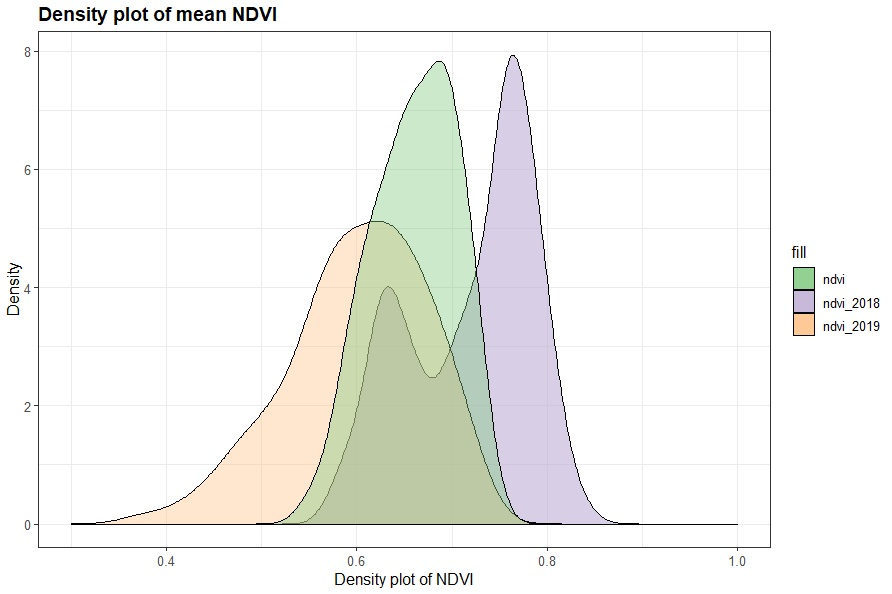


```{r}
MZ joined$ID <- seq.int(nrow(MZ joined))
dataframe = fortify(MZ joined)
dataframe$geometry <- NULL
dataframe <- dataframe[c(1:12,15:17,20,22,24,25)]
data.pca <- prcomp(dataframe[,c(9:15,17:19)], scale = TRUE)
summary(data.pca)
autoplot(data.pca, colour = ’white’, loadings = TRUE, loadings.label = TRUE, loadings.label.size = 5)
```
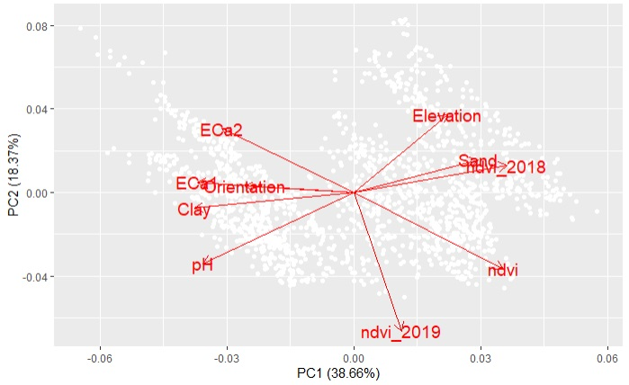

```{r}
# To check PC scores
data.pca$rotation
```

> Results printed:

> Variable; PC1; PC2

> Elevation; 0.2244102; 0.37895394

> ECa2; -0.3164452; 0.31040253

> [ndvi]; 0.3575164; -0.37110163

> [ndvi 2018]; 0.3678101; 0.13146102

> [ndvi 2019]; 0.1136207; -0.67246147

> Orientation; -0.2613542; 0.03316584

> ECa1; -0.3745638; 0.04875610

> Clay; -0.3811520; -0.07620690

> pH; -0.3613388; -0.34362539

> Sand; 0.2984024; 0.15961924

According to the new PCA, the two main components are capable to explain about 57% of total
variation. It is possible to observe that ECa2 is negatively correlated to mean NDVI for both PC1
and PC2 (i.e. similar absolute value of the scores but different signals). Elevation is also correlated
with mean NDVI (mostly in PC2) and also to both NDVI mean 2018 and 2019 (in PC1). Elevation
is positively correlated to NDVI for 2018 and negatively correlated to NDVI for 2019. This is likely
to be explained by differences in regard to rainfall. The most important variables are NDVI (mean of
the two years as well as the means of each year), Elevation and ECa2. Therefore, the classification
of management zones will take these three types of variables into account.

## 4 Management zones & sampling points

This stage takes into consideration the available amount of soil moisture probes (N) to be used.
In real decision situations, farmers and researchers, due to financial constraints, are limited by the
amount of technology available. In our case, we have 10 capacitance probes (N=10) to use, and we
intend to guarantee at least 2-3 repetitions per zone, which means that we will be able to consider
a maximum number of 3-4 measuring zones.

### 4.1 Minimum amount of management zones

Here we conduct an analysis with library(cluster) to check whether the amount of clusters considered
is representative enough of our spatial variation.

```{r}
# Upload library cluster
library(cluster)
# I will work with Elevation, ECa2 and the means of NDVI 
data <- dataframe[c(9,12,16:18)]
data.scale <- scale(data[,c(1,2,3,4)])

fviz_nbclust(data.scale, FUN = hcut, method = "wss")

# Elbow method
fviz_nbclust(data.scale, kmeans, method = "wss") +
    geom_vline(xintercept = 4, linetype = 2)+
  labs(subtitle = "Elbow method")

# Silhouette method
fviz_nbclust(data.scale, kmeans, method = "silhouette")+
  labs(subtitle = "Silhouette method")

# Gap statistic
fviz_nbclust(data.scale, kmeans, method = "gap_stat")+
  labs(subtitle = "Gap Stat method")
```
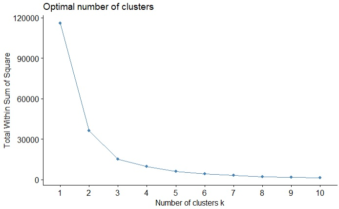

The proposed amount of 3-4 zones seems representative enough since adding more classes would
not low the total within sum of square of this classification.

### 4.2 Regression analysis

In this section we aim to confirm weather the variation of physical properties has an agronomic
meaning. First, Elevation and ECa2 are plotted against NDVI. The effect of the year is quite
visible in the relation Elevation x NDVI due to the large differences observed in regard to rainfall.
As a consequence, we plot this relation for each year separately. NDVI correlates to Elevation
through a quadratic form that seems to change it’s concavity orientation according to the amount
of rainfall. However the regression keeps a comparable shape as the turning point (where first
oder derivative equals zero) is obtained practically at the same elevation (175.54 m). This value (elevation-threshold) corresponds to a threshold value from which the response curve changes the
slope signal. Mathematically, this threshold is estimated by solving the zeros of the first order
derivative. 

```{r}
ggplot(data, aes(x=Elevation, y=ndvi 2018)) + geom_point(shape=21, size=2, stroke=1.5, fill=”darkslategray3”) +
# Set static color and size for points_geom_smooth(method=”lm”, formula = y~poly(x,2,raw=T), col=”red”) + #
change the color of line stat_poly_eq(formula = y~poly(x,2,raw=T), aes(label = paste(..eq.label.., ..rr.label.., sep =
”~~~”)), parse = TRUE) + scale_colour_brewer(palette = ”Set1”) + coord_cartesian(xlim=c(160, 200), ylim=c(0.3,
1)) + geom_vline(aes(xintercept=174.78), color=”blue”, linetype=”dashed”, size=1) + labs(title=”Elevation vs.
mean NDVI”, subtitle=”How does NDVI correlate to Elevation?”, y=”NDVI”, x=”Elevation (m)”, caption=”NDVI
mean (9.5 ha)”)

ggplot(data, aes(x=Elevation, y=ndvi 2019)) + geom_point(shape=21, size=2, stroke=1.5, fill=”goldenrod”)
+ # Set static color and size for points_geom_smooth(method=”lm”, formula = y~poly(x,2,raw=T),
col=”red”) + # change the color of line stat_poly_eq(formula = y~poly(x,2,raw=T), aes(label =
paste(..eq.label.., ..rr.label.., sep = ”~~~”)), parse = TRUE) + scale_colour_brewer(palette = ”Set1”) +
geom_vline(aes(xintercept=176.31), color=”blue”, linetype=”dashed”, size=1) + coord_cartesian(xlim=c(160, 200),
ylim=c(0.3, 1)) + labs(title=”Elevation vs. mean NDVI”, subtitle=”How does NDVI correlate to Elevation?”,
y=”NDVI”, x=”Elevation (m)”, caption=”NDVI mean (9.5 ha)”)

ggplot(data, aes(x=ECa2, y=ndvi)) + geom_point(shape=21, size=2, stroke=1.5, fill=”dodgerblue”) + # Set static
color and size for points_geom_smooth(method=”lm”, formula = y~x, col=”red”) + stat_poly_eq(formula = y~x,
aes(label = paste(..eq.label.., ..rr.label.., sep = ”~~~”)), parse = TRUE) + scale_colour_brewer(palette = ”Set1”)
+ coord cartesian(xlim=c(0.3, 1.25), ylim=c(0.3, 1)) + labs(title=”Eca vs. mean NDVI”, subtitle=”How does NDVI
correlate to ECa?”, y=”NDVI”, x=”Deep Eca (dS/m)”, caption=”NDVI mean (9.5 ha)”)

# solve 1st derivative for E x NDVI 2018
deriv(~ 7.65-(0.0797*x)+(0.000228*(x2)), ”x”)
a = (0.0797 / 0.000228) / 2 # 174.78

# solve 1st derivative for E x NDVI 2019
deriv(~ -10.6-(0.128*x)+(0.000363*(x2)), ”x”)
b = (0.128 / 0.000363) / 2 # 176.31

Elevation threshold = (a+b)/2

Elevation threshold # 175.54 m
```
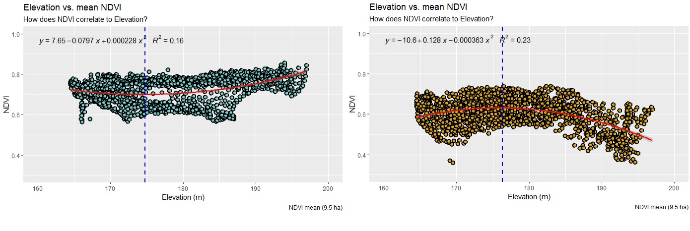


Once confirmed the correlation between soil physical properties (Elevation, ECa2) and agronomic
measures (in this case the annual means of NDVI), a classification algorithm is performed in order
to cluster four management zones.

### 4.3 Clustering for management zone delineation

In this section we apply a clustering algorithm for classification of management zones (i.e. k-means
clustering). The clustering process employs only 4 variables (Elevation, ECa2 and the means of
NDVI for both 2018 and 2019). The dataset contains features varying in different magnitudes,
units and ranges (e.g. Elevation in units of meters, both NDVI and ECa varying in decimals, NDVI
unitless, ECa in dS/m). Since computation uses an eucledian distance between data points this
must considerably affect our results. In order to solve this issue, we must scale our data by applying
the R function scale() .

For more information related to k-Means and scaling features, please check:

- https://uc-r.github.io/kmeans_clustering

- https://becominghuman.ai/demystifying-feature-scaling-baff53e9b3fd

```{r}
library(cluster) # for clustering algorithms

# Subset dataframe
data <- dataframe[c(9,12,16:19)]
df <- data

# Scale variables Elevation, ECa2, NDVI mean, NDVI 2018, NDVI 2019
df.stand <- scale(df[,c(1,2,5:6)]) # For Elevation, ECa2, NDVI 2018 and NDVI 2019

# To minimize randomness set.seed(125)
cluster <- kmeans(df.stand, 4) # The K-Means Algorithm
df$cluster <- cluster$cluster

# Plot the cluster
fviz cluster(cluster, data = df.stand)
```
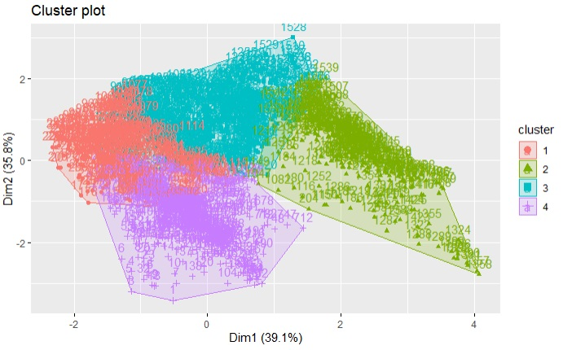

Data is clustered according to the selected principal components and the ’df’ data frame is
merged with the shapefile MZ joined by the attribute ID.

```{r}
# Add clusters to spatial data
rm(mergedata)
mergedata <- merge(x = MZ joined, y = df, by = ”ID”)

# Recall data
names(mergedata)[names(mergedata) == ”cluster”] <- ”ZONE”
names(mergedata)[names(mergedata) == ”Elevation.y”] <- ”Elevation”
names(mergedata)[names(mergedata) == ”ECa2.y”] <- ”ECa2”
names(mergedata)[names(mergedata) == ”ndvi.y”] <- ”NDVI mean”
mergedata$ZONE[mergedata$ZONE == ”1”] <- ”A”
mergedata$ZONE[mergedata$ZONE == ”2”] <- ”B”
mergedata$ZONE[mergedata$ZONE == ”3”] <- ”C”
mergedata$ZONE[mergedata$ZONE == ”4”] <- ”D”

# Create a color palette
mycols <- c(”#3CB371”, ”#7B68EE”, ”#FFA07A”, ”#FFD700”)

# Prepare maps
map_MZ <- tm_shape(mergedata) + tm_dots(col = ”ZONE”, palette = ”mycols”, n=5) + tm_style(”cobalt”)
map_Elevation <- tm_shape(mergedata) + tm_dots(col = ”Elevation”, palette = ”Spectral”, n=5) +
tm_style(”cobalt”)
map_ECa <- tm shape(mergedata) + tm_dots(col = ”ECa2”, palette = ”Reds”, n=5) + tm_style(”cobalt”)
map_NDVI <- tm_shape(mergedata) + tm_dots(col = ”NDVI_mean”, palette = ”YlGn”, n=5) + tm_style(”cobalt”)

# Display facets
tmap_arrange(map_MZ, map_Elevation, map_ECa, map_NDVI, ncol=4)
```
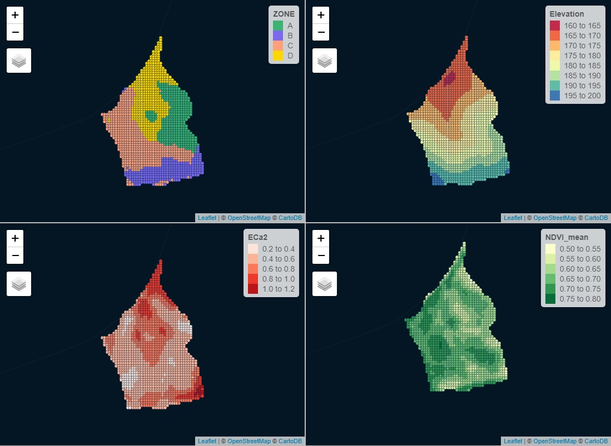
### 4.4 Representative points for sampling

Considering the correlation between ECa2 and NDVI, the selection of representative points for
sampling is done through an analysis of ECa histograms. The idea is to select the most representative
ranges of values from density plots for each management zone.

```{r}
library(RColorBrewer)
# stack density plot

g <- ggplot(mergedata, aes(x = ECa2, fill=Zone)) + geom_density(position=”identity”, alpha=0.6) +
scale_x_continuous(name = ”Density plot of NDVI”, breaks = seq(0, 1, 0.2), limits=c(0.3, 1)) +
scale_y_continuous(name = ”Density”) + ggtitle(”Density plot of mean NDVI”) + theme_bw() + theme(plot.title
= element_text(size = 14, family = ”Tahoma”, face = ”bold”), text = element text(size = 12, family = ”Tahoma”))

g <- g + scale_fill_discrete(name=’ZONE’,labels=c(”A”, ”B”, ”C”, ”D”))
g <- g + scale_fill_brewer(palette=”Accent”)

# Vertical dashed lines - intervals of ECa to select representative points

g <- g + geom_vline(aes(xintercept=0.72), color=”gold2”, linetype=”dashed”, size=1) +
geom_vline(aes(xintercept=0.75), color=”gold2”, linetype=”dashed”, size=1)
g <- g + geom_vline(aes(xintercept=0.58), color=”darkorchid1”, linetype=”dashed”, size=1) +
geom_vline(aes(xintercept=0.63), color=”darkorchid1”, linetype=”dashed”, size=1)
g <- g + geom_vline(aes(xintercept=0.46), color=”forestgreen”, linetype=”dashed”, size=1) +
geom_vline(aes(xintercept=0.48), color=”forestgreen”, linetype=”dashed”, size=1)
g <- g + geom_vline(aes(xintercept=0.43), color=”darksalmon”, linetype=”dashed”, size=1) +
geom_vline(aes(xintercept=0.45), color=”darksalmon”, linetype=”dashed”, size=1)
g
```
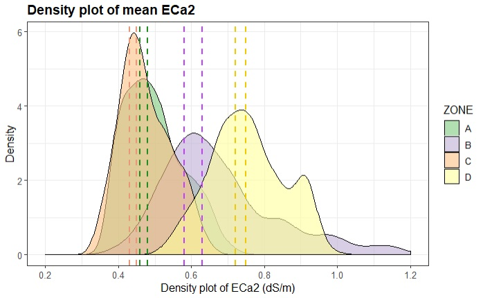

### 4.5 Mapping 2 sample

The following map indicates the proposed points to install soil moisture probes. Each colored
dot represents a point with maximum and relatively equal representativeness of the corresponding
management zone (different colors indicate different management zones). The installation should
take into account the farming traffic directions in order to minimize disturbance. We have 10 probes,
2 will be installed in zone B, 2 in zone A locations and 3 probes in management zones C and D (all
aligned with the tractor rows).

```{r}
# Define sampling points
mergedata$Probes <- ”0 NO Probe”
mergedata$Probes[mergedata$ZONE == ”A” & mergedata$ECa2 > 0.46 & mergedata$ECa2 < 0.48] <- ”A”
mergedata$Probes[mergedata$ZONE == ”B” & mergedata$ECa2 > 0.58 & mergedata$ECa2 < 0.63] <- ”B”
mergedata$Probes[mergedata$ZONE == ”C” & mergedata$ECa2 > 0.43 & mergedata$ECa2 < 0.45] <- ”C”
mergedata$Probes[mergedata$ZONE == ”D” & mergedata$ECa2 > 0.72 & mergedata$ECa2 0.75] <- ”D”

mycols <- c(”3CB371”, ”7B68EE”, ”FFA07A”, ”FFD700”)
map_MZ <- tm_shape(mergedata) + tm_dots(col = ”ZONE”, palette = mycols, n=5) + tm_style(”cobalt”)

mycols <- c(”F5F5F5”, ”3CB371”, ”7B68EE”, ”FFA07A”, ”FFD700”)
map_Probes <- tm_shape(mergedata) + tm_dots(col = ”Probes”, palette = mycols, n=5) + tm_style(”cobalt”)

# Display facets
tmap arrange(map_MZ, map_Probes, ncol=2)
```

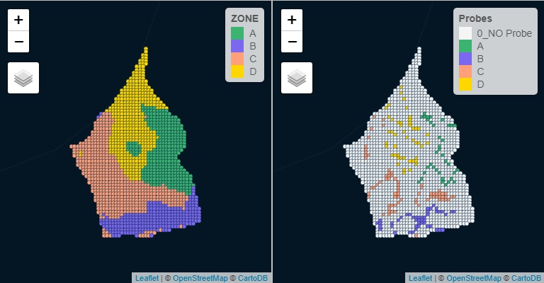

Check final result at:
> https://github.com/RoquetteTenreiro/Mapping2Sampe_R/blob/master/FinalMap.jpg


## 5 Additional reading material

- https://www.datanovia.com/en/blog/top-r-color-palettes-to-know-for-great-data-visualization/

- https://github.com/RoquetteTenreiro/SDAE_R_lecture

- https://geocompr.robinlovelace.net/

- https://www.rspatial.org/index.html
